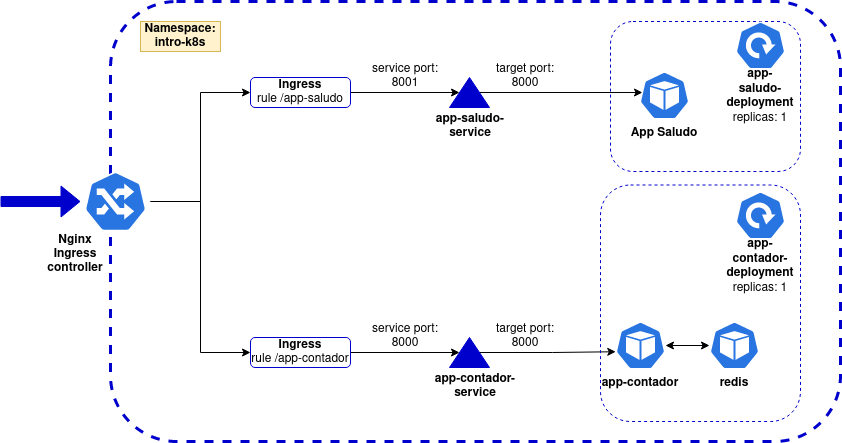

# intro-k8s
Repositorio con manifiestos de kubernetes para la parte practica de la introduccion conceptual a kubernetes.

Tomaremos como base la siguiente arquitectura simple:

Esta aplicacion simple consta de dos partes:

1 - Una app que muestra saludos en distintos idiomas (/, /en, /de, /it)

2 - Un contador de visitas

Las imagenes a utilizar se encuentran en el Docker hub publico "matiops/intro-k8s".
Si desea almacenarlas en su propio repositorio de imagenes, se provee el codigo fuente de ambas aplicaciones.

## Setup de laboratorio

Para la realizacion del video se ha utlizado [microk8s](https://microk8s.io/) (v1.28.3) para provisionar un cluster local.

Tambien es necesaria la instalación de [kubectl](https://kubernetes.io/docs/tasks/tools/).

## Algunos comandos utiles en caso de utilizar microk8s:
Para iniciar el cluster en microk8s
- `microk8s start`

Generar kubeconfig
- `microk8s config > ~/.kube/microk8s`

Configurar el kubeconfig a utilizar para conectarse al cluster
- `export KUBECONFIG=~/.kube/microk8s` 

Habilitar el nginx ingress controler que viene con microk8s
- `microk8s enable ingress`

Detener el cluster:
- `microk8s stop`

Acceder al dashboard:
- Seguir los pasos en [esta](https://microk8s.io/docs/addon-dashboard) guia.
TL;DR:

1 - `microk8s enable dashboard`

2 - `microk8s kubectl create token default`

3 - `microk8s kubectl port-forward -n kube-system service/kubernetes-dashboard 10443:443`

4 - Accedemos desde el navegador por https://127.0.0.1:10443

5 - Seleccionamos autenticacion por token y pegamos el obtenido en el paso 2
