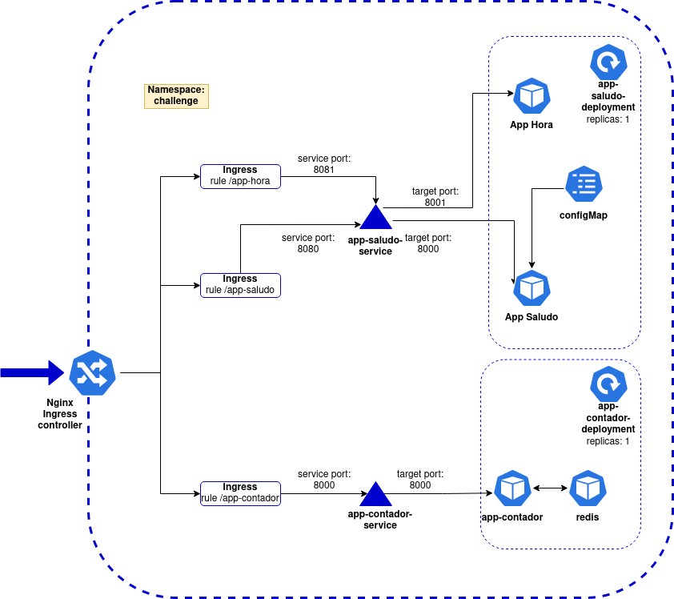

## Challenge
> Dime y lo olvido. Enseñame y lo recuerdo. Involúcrame y lo aprendo.
--Benjamin Franklin.

En esta sección entrontrarás un pequeño challenge para poner en práctica lo visto hasta el momento. 

Las consignas son las siguientes:

1 - Levantar en un cluster de kubernetes la siguiente arquitectura. Notarás que es muy similar a la utilizada en el video. Se proveén plantillas de manifestos que puede utilizar.

2 - Modificar la aplicacion "app-saludo". Los mensajes no deben estar hardcodeados, si no que los deberá leer de las siguientes variables de entorno: SALUDO_ES, SALUDO_IT, SALUDO_EN y SALUDO_DE

3 - Crear un recurso de kubernetes del tipo "configMap" para proveer a los pods de la app-saludos las correspodietes variables de entorno, y sus valores. Puede encontrar la documentación de configMap [aca](https://kubernetes.io/es/docs/concepts/configuration/configmap/)

4 - Crear una aplicación "app-hora", que simplemente retorna la hora actual.

5 - Tanto esta aplicación como la de saludo deben utilizar el mismo service.

6 - Implementar un ingress para poder accede a las 3 aplicaciones.

7 - Alojar las imagenes en un repositorio propio. Una vez que las aplicaciones levanten correctamente, modificar el repositorio y pasarlo a PRIVADO. Investigar como debe autenticarse el cluster para poder hacer pull de las imágenes.